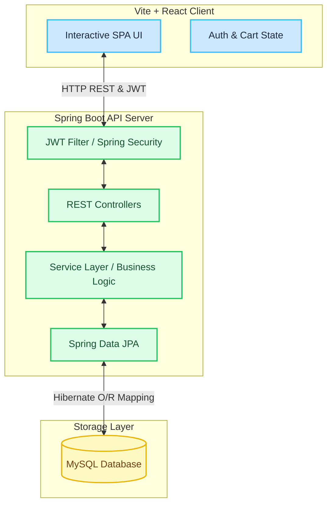

# 👟 JutaHindustani — E-Commerce Shoe Platform

[](https://spring.io/projects/spring-boot)
[](https://react.dev)
[](https://vite.dev)
[](https://tailwindcss.com)
[](https://www.mysql.com)

A modern, full-stack, and responsive e-commerce web application specialized in selling footwear. Engineered with a Spring Boot backend API and a fast React single-page application (SPA) powered by Vite.

---

## 🏗️ Architecture & Technology Stack

The application employs a decoupled client-server architecture with state-of-the-art framework capabilities.



### 💻 Frontend
* **React 19** & **Vite 8**: High-performance rendering engine and bundler with hot module replacement (HMR).
* **Tailwind CSS v4**: Utility-first styling engine driving cohesive responsive design patterns.
* **React Hook Form**: Performant, extensible form validation.
* **Lucide React**: Clean and minimal modern vector icons.
* **Axios**: Promised-based HTTP client interfacing with backend REST API.

### ⚙️ Backend
* **Spring Boot 3.3**: Enterprise-grade Java application framework.
* **Spring Security & JJWT (0.12.5)**: Stateless session management securing REST endpoints with JSON Web Tokens.
* **Spring Data JPA & Hibernate**: Object-relational mapping facilitating persistent MySQL storage.
* **Lombok**: Boilerplate reduction library for cleaner model classes.
* **MySQL Connector/J**: Official database connectivity driver.

---

## ⚡ Windows Quick Start Guide

Follow these steps to configure, seed, and launch the application in your local environment.

### Step 1: Database Setup (MySQL)

1. Make sure your local **MySQL Server** is running.
2. The application is configured to automatically create the database `jutahindustani` if it does not already exist.
3. Open `backend/src/main/resources/application.properties` and customize the connection string and credentials:
   ```properties
   spring.datasource.url=jdbc:mysql://localhost:3306/jutahindustani?createDatabaseIfNotExist=true&useSSL=false&allowPublicKeyRetrieval=true&serverTimezone=UTC
   spring.datasource.username=YOUR_MYSQL_USERNAME
   spring.datasource.password=YOUR_MYSQL_PASSWORD
   ```

---

### Step 2: Launch the Backend API Server

The backend includes a Maven wrapper, eliminating the need to install Maven globally on your system.

1. Open a new **PowerShell** window.
2. Navigate to the `backend` folder:
   ```powershell
   cd backend
   ```
3. Boot up the Spring Boot server using the Maven wrapper:
   ```powershell
   .\mvnw spring-boot:run
   ```
   *(If you are running from standard Command Prompt (CMD), run `mvnw spring-boot:run` instead.)*
4. The server will boot up and bind to **`http://localhost:8080`**.

---

### Step 3: Launch the Frontend Web Client

1. Open a **second** terminal window or tab.
2. Navigate to the `frontend` folder:
   ```powershell
   cd frontend
   ```
3. Install the dependencies and initiate the Vite development server. If script execution policies restrict NPM scripts on your PowerShell session, execute commands directly via `npm.cmd`:
   ```powershell
   # Bypass Windows execution policies with npm.cmd
   npm.cmd install
   npm.cmd run dev
   ```
4. Once running, open your web browser and access the application at the port indicated in the terminal (typically **`http://localhost:5173`**).

---

## 🔑 Default Test Accounts

To facilitate instant evaluation, the database auto-seeds the following roles during first-time execution:

### 👤 Customer Role
* **Email:** `test1@gmail.com`
* **Password:** `customer123`
* **Features:** Search and filter catalog, inspect product details, manage cart, place orders, view order history.

### 🔑 Administrator Role
* **Email:** `test@gmail.com`
* **Password:** `admin123`
* **Features:** Full CRUD access over products (shoes) inventory, categorize products, browse all client orders, and update shipping/fulfillment states.

---

## ❤️ Wishlist & Favorites Feature

We have added a fully persistent, secure, and reactive **Wishlist & Favorites** module across the entire stack.

### ⚙️ Backend REST APIs (Exposed under `/api/v1/wishlist` & `/api/wishlist`)
All endpoints are secured behind custom JWT filter gates and map to the active logged-in User Principal:
* **`GET /`** — Retrieves list of all wishlisted product entries with complete shoe specifications.
* **`POST /add/{productId}`** — Safely persists a shoe to the user's wishlist (robustly prevents duplicates).
* **`DELETE /remove/{productId}`** — Removes a shoe from the wishlist.
* **`GET /check/{productId}`** — Utility check returning `true` or `false` indicating active favorited status.

### 🎨 Frontend UI Integrations
* **Dynamic Overlay Hearts**: Clickable heart fav icons positioned on top of catalog item cards ([ProductCard.jsx](file:///c:/Users/priyanshu/Downloads/JutaHindustani/frontend/src/components/common/ProductCard.jsx)) with real-time reactive global state updates.
* **Product Details Action**: A premium outline/filled favoriting button nestled next to the "Add to Bag" element ([ProductDetails.jsx](file:///c:/Users/priyanshu/Downloads/JutaHindustani/frontend/src/pages/products/ProductDetails.jsx)).
* **Navigation Header Badge**: A live navbar favoriting badge showing exact active counts ([Navbar.jsx](file:///c:/Users/priyanshu/Downloads/JutaHindustani/frontend/src/components/layout/Navbar.jsx)).
* **Wishlist Screen**: A responsive favorites grid page ([Wishlist.jsx](file:///c:/Users/priyanshu/Downloads/JutaHindustani/frontend/src/pages/wishlist/Wishlist.jsx)) with clean empty-states.

